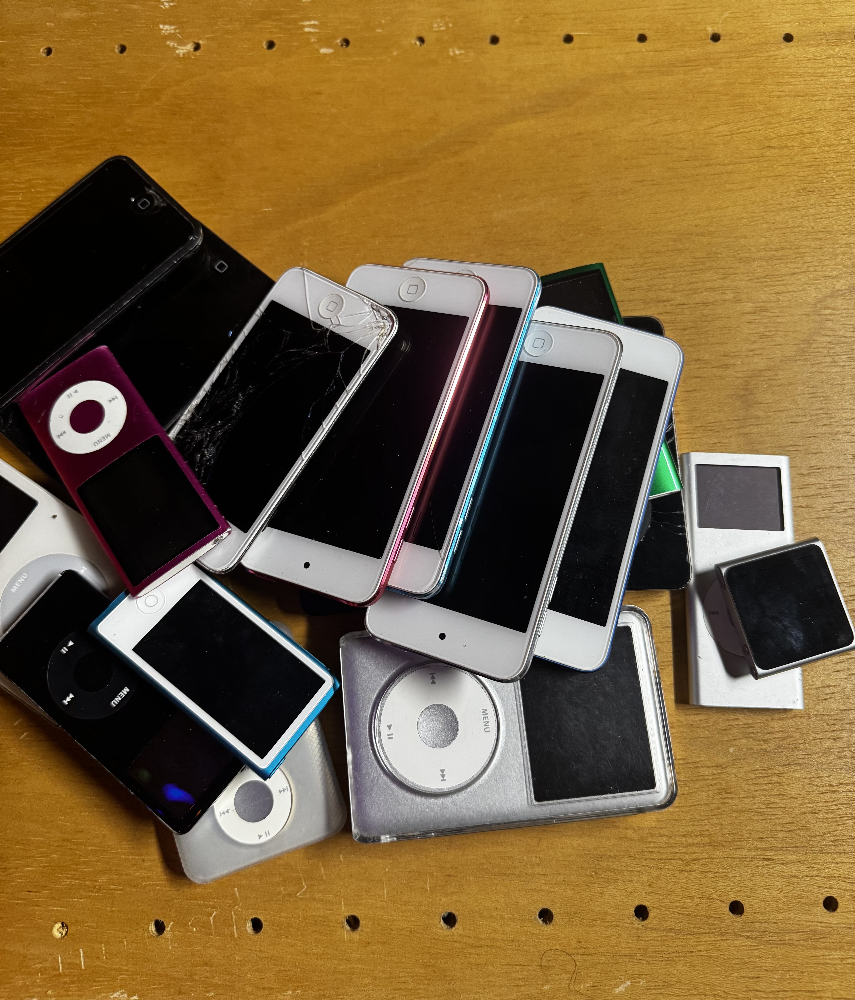

New Presentation Who Dis?
===
<!-- alignment: center -->
Dublin
<!-- pause -->
- Senior Engineer on growth team at a SaaS startup in Nebraska
<!-- pause -->
- BA in Computer Science @uark, December 2015
<!-- speaker_note: when I started I was debugging JSF servers using ICEfaces and now AI is eating everything and claude writes it all for me, golly  -->
<!-- pause -->
- two cats
<!-- pause -->
- 11 chickens
<!-- pause -->
<!-- end_slide -->
How Did I Get Here?
===
<!-- alignment: center -->
<!-- speaker_note: why am i giving a talk about ferrous pasta and old stuff -->
<!-- pause -->
<!-- speaker_note: Growing up in NJ I had access to lots of things to mess around with, stripping down old bikes and not putting them back together -->
- Tinkering and modding stuff.
<!-- pause -->
- Rebuilt and softmodded a PSP
- pic of psp 200
<!-- pause -->
- Modding guitars literally found on the side of the street
- pic of my stratocaster
<!-- pause -->
- I enjoy using items that do more than they're supposed to. 
- It's radical to see things used longer than our capitalist overlords intended.

<!-- speaker_note: I'm really old -->
<!-- end_slide -->

Getting My Start
===
<!-- pause -->
<!-- speaker_note: Lovely little place down in Fayetteville called FreeGeek -->

<!-- alignment: center -->
<!-- pause -->
- 521 W Ash St, Fayetteville, AR 72703 (down the road from Fossil Cove)
<!-- pause -->
<!-- speaker_note: they take almost any electronic item, even car batteries, someone dropped off a telephone switchboard one time -->
- e-waste recycling
<!-- pause -->
<!-- speaker_note: reimage machines and put linux on them so they can be re-sold -->
<!-- speaker_note: similar to geeksquad -->
- IT support
<!-- pause -->
<!-- speaker_note: testing and pricing electronic items for sale in the thrift store -->
<!-- speaker_note: depending on skillset you can specialize in certain tech -->
<!-- speaker_note: volunteer hours count towards class credits -->
- volunteering
<!-- pause -->
- enabling my crippling addiction to hoarding outdated technology

<!-- end_slide -->
Reject modernity; return to ~~monke~~ froot
===
<!-- alignment: center -->
<!-- pause -->
<!-- speaker_note: this is the first one I picked up, a 5.5th Gen iPod (if it has search then it's 5.5th gen!) -->
<!-- speaker_note: I was so excited, I hadn't had one since 2011, I had a large music collection leftover from highschool that I've been carrying around on HDDs I can explore again -->
<!-- speaker_note: No more using spotify, I was free -->
<!-- column_layout: [3, 2] -->
<!-- column: 0 -->
2024

<!-- column: 1 -->
<!-- pause -->
Walking out the store like:

<!-- reset_layout -->
<!-- pause -->
But wait..
<!-- pause -->
is it enough?
<!-- end_slide -->
Time To Upgrade
===
<!-- column_layout: [3, 3] -->
<!-- alignment: center -->
<!-- pause -->

<!-- column: 0 -->
- 30GB stock, small boi
<!-- pause -->
<!-- speaker_note: using ALAC for a lot of my music, blows their estimation of 4min @128Kbps mp3 back in the elder days -->
- 320GB library, many lossless formatted
<!-- pause -->

<!-- pause -->
Don't tear the ribbon cables!
<!-- column: 1 -->
<!-- speaker_note: the hardware is designed to interface with the iPods, so they have a ZIF connector, just pop out the old ZIF drive and put the new one in -->

<!-- pause -->
- iFlash Solo
<!-- pause -->
- 512GB SD Card
<!-- pause -->

- whole library fits!
- we're done!
<!-- reset_layout -->
<!-- pause -->

I am enjoying this.
<!-- end_slide -->

The End
===
<!-- pause -->
<!-- alignment: center -->
<!-- speaker_note: and... another -->
<!-- end_slide -->

A few months later
===

<!-- alignment: center -->
RIP my wallet. Change the pic to the whole collection too
<!-- pause -->
<!-- speaker_note: Fast forward a few months, and things have dengenerated, I have this giant pile of devices, I've upgraded / repaired a lot of them, some are just hunks of junk because of activation lock. -->
<!-- end_slide -->

The Ingredients
===
<!-- alignment: center -->
<!-- pause -->
Accumulated a lot of devices
<!-- pause -->
<!-- speaker_note: nothing much to cover in the way of upgrading Zunes other than they can't read greater than 120GB if I remember right, and you can only use a few select SSD type ZIF Drives, iPod Classics and Zunes share similar batteries though! -->
iPods, Zunes, GoGears
<!-- pause -->
Upgrades, Repairs, and Lost Causes
<!-- speaker_note: as far as I can tell, you cannot purchase the screen to repair a Philips GoGear 30GB -->
<!-- pause -->
Obnoxious compatibility, make this a word art PNG

<!-- end_slide -->
I. The problem
===

<!-- speaker_note: I have a fun set of constraints, also I may have missed an app in the ecosystem that would have made this easier but I was already thinking about the recipe, in my dreams --> 

Constraints: 
<!-- alignment: left -->
<!-- pause -->
- Windows has the best compatibility
<!-- pause -->
  - I don't use it  
- macos has ipod support
  - Apple Music is subpar for iPods lately
  - no Zune support
<!-- pause -->
- Rockbox is a good alternative and works on Linux
  - my exp was tricky
- Other bizarre alternatives:
<!-- pause -->
  - buy an old mac and upgrade the SSD and manually manage music on it
<!-- pause -->
  - VM (it's just not as fun, Mom!)
  - Learning the naming algorithm and manually adding songs yourself TODO check if this is actually something you can do
<!-- pause -->

Goals: 
- macos and Linux compatible application
- TUI because I'm cracked out on LLM heroine and saw a coworker build a terminal app and I wanted the cyberpunk aesthetic
- Rust native
<!-- pause -->
  - this will change later

<!-- pause -->

<!-- end_slide -->

Disclaimer: 
===
<!-- alignment: center -->
<!-- pause -->
I cobbled this together from commit logs because I was an Enter pressing machine and just focused on QA. 

<!-- pause -->
This was earlier(?) on when I started using LLMs for coding, and I was exercising how much I could let go and how much I could get done.
- I'm still really lazy sob emoji

<!-- end_slide -->

MVP
===

<!-- alignment: center -->
- Export the Library.xml from Apple music, claude go make it

From here we need to start digging into the phases of the work that was done so the git history aligns with it. 

- Initial implementation
- Transition away from aft-mtp-cli and IOKit
- TODO fill this out with what was made first

<!-- pause -->

* [`rodio`](https://crates.io/crates/rodio) — local playback
* [`ratatui`](https://crates.io/crates/ratatui) — the entire TUI
* [`rusb`](https://crates.io/crates/rusb) — USB device detection
* [`lofty`](https://crates.io/crates/lofty) — tag reading across every format I care about
* [`symphonia`](https://crates.io/crates/symphonia) + [`mp3lame-encoder`](https://crates.io/crates/mp3lame-encoder) — pure-Rust decode/transcode, no ffmpeg required for audio
* [`discid`](https://crates.io/crates/discid) — CD table-of-contents reads, LGPL, dynamically linked

<!-- end_slide -->

Yay Themes
===

<!-- alignment: center -->
- I wanted to emulate winamp with crazy themes
- find winamp picture 
<!-- pause -->
- it's a TUI though so only color and ASCII visuals 
<!-- pause -->
- add a video here of the TUI themes being toggled while a song is playing

<!-- end_slide -->

Album Art
===

<!-- alignment: center -->
Terminals aren't known for pictures. Do it anyway.
<!-- pause -->
It looks terrible, and it fits the cyberpunk aesthetic!
<!-- pause -->
Why not render them using [``](https://crates.io/crates/)
<!-- pause -->
I don't want to.
- TODO add screenshot of the album art

<!-- end_slide -->

Zune Support
===

<!-- alignment: center -->

<!-- pause -->

What does it take to make a Zune talk to other OSes?
- TODO maybe add info about how the zune works

<!-- end_slide -->

A. Rewriting libmtp-zune in Rust
===

<!-- alignment: center -->

The Zune doesn't speak plain MTP (Media Transfer Protocol). It speaks **MTPZ** — Microsoft's
encrypted variant — [`libmtp-zune`](https://github.com/kbhomes/libmtp-zune), a
reverse-engineering project in C.

- C!? We can't be having that here. Sorry Dennis Richie :'(

<!-- pause -->

<!-- pause -->
Port it to Rust!

<!-- pause -->
`zune-mtp` ports that protocol knowledge — RSA-1024 signing, a
PSS-like certificate exchange, AES-128-CBC, CMAC key extraction — into
a native IOKit transport, bypassing libusb entirely because libusb
can't do the data-out operations the handshake needs.

<!-- end_slide -->

Claude build me a hammer
===

<!-- alignment: center -->

I wanted to start from scratch and I'm clueless so I asked Claude to take a look.
It suggested probing the device to understand what it support and do research on what's been done already.

<!-- pause -->

- Have Claude scaffold a throwaway probe binary, run it once against the real device,
read the result, delete or keep if it works.

- Honestly surprised I didn't brick it

<!-- pause -->

- `tools/mtp-probe` is where everything that worked ended up
- TODO if this isn't committed to the repo then we shouldn't reference the file

<!-- end_slide -->

Everything IS a nail when you have a Claude Hammer
===

<!-- alignment: center -->

- We poke around and finally get the handshake woring.
<!-- pause -->
- `SendObjectInfo` → `SendObject` → a song is *on the device*.
- Sync, push, remove, device browsing
- aww CRUD, it works

<!-- end_slide -->

What the □□□□
===

<!-- alignment: center -->

<!-- pause -->

Music was syncing. Then I looked at the album browser.

- Why are my vaporwave tracks rendering as blocks?

- Deep in the past the true wizards crafted a workaround for this
<!-- pause -->
- for Zune 1.4

- v1 firmware family was a Windows CE flavor
- You can load font files onto the device and they'll pick up the right glyphs
- All my zunes are v3.3, this can't work

<!-- end_slide -->

Hackerman
===

<!-- alignment: center -->

<!-- pause -->

Second instinct, once "gracefully" started meaning "worse": stop
guessing and write small probes against the device.

List the props the firmware actually serves. Dump a working sync.
Diff that against ours. Repeat.

<!-- pause -->

The glyph coverage I needed showed up on **1.4**. That's the box I
used for the rest of this work — the useful lesson for zytunes
was the probe loop.

1.4 doesn't rewrite the font table — but the glyph set it ships
covers more of what I needed, and the MTP/MTPZ stack is the same one
the rest of this talk is about.

- TODO add firmware tradeoffs (the ones you care about)

<!-- pause -->

<!-- end_slide -->

Zune 3.0 looks clean though
===

<!-- alignment: center -->

<!-- pause -->

So zytunes doesn't force a firmware choice — it supports both, and adds
**photo and video sync** (`photo-sync`, `video-sync`) for the newer
firmware's Pictures/Video stores, transcoding video to WMV2/WMAv2 via
ffmpeg along the way.

<!-- end_slide -->

V. The iPod
===

<!-- alignment: center -->

<!-- pause -->

After the Zune, this felt almost relaxing.

<!-- pause -->

No encrypted handshake — a classic iPod just mounts as a USB mass-storage
volume. The hard part isn't talking to it, it's getting **iTunesDB**
bit-exact: mhit/mhbd records, hash58 signing, ArtworkDB thumbnails,
ported from `libgpod` from scratch in the `ipod-db` crate.

<!-- pause -->

"Apple still supports it" turns out to mean about the same thing as
"Microsoft still supports the Zune." In practice, both are on me now.

<!-- end_slide -->

Shifting foundations
===

<!-- alignment: center -->

<!-- pause -->

Somewhere around month two, the "weekend project" architecture started
showing its age.

<!-- end_slide -->

A. Removing Library.xml
===

<!-- alignment: center -->

Remember that convenient MVP shortcut from section III?

<!-- pause -->

Apple's XML export doesn't carry the metadata a real device-sync tool
actually needs, and it's one more moving part tied to one specific app
on one specific OS.

<!-- pause -->

`feat!: remove iTunes Library.xml support` — directory scanning became
the *only* library backend. Slower to set up. Correct forever after.

<!-- end_slide -->

B. I can get the stain out
===

<!-- alignment: center -->

The unglamorous, load-bearing refactor work:

<!-- end_slide -->

1. God file!
===

<!-- alignment: center -->

`app.rs` and `native.rs` had both grown into the kind of file where
"just add one more match arm" stops being a joke.

<!-- pause -->

Split into `tui/app/keys.rs`, `tui/app/events.rs`, decomposed `native.rs`
into focused pieces — same behavior, files a human can actually hold in
their head again.

<!-- end_slide -->

2. Security?
===

<!-- alignment: center -->

Not a pentest — the boring kind of security: `unwrap()` calls that
would panic the whole TUI on a malformed USB response, `String` errors
that made every failure mode a guessing game.

<!-- pause -->

Typed `MtpError`/`DeviceError` enums, `unwrap()` swept out of the hot
paths, CI wired up with dependency + security scanning so this doesn't
regress quietly.

<!-- end_slide -->

3. Using TDD correctly :P
===

<!-- alignment: center -->

The `DeviceSession` trait exists specifically so sync/remove/collect
logic can be tested against a fake — no hardware required, no flaky
USB-in-CI nonsense.

<!-- pause -->

Behavior asserted, not mocks — did the right bytes land in the right
file, not "was `write` called." Failing test first, then the code that
makes it pass.

<!-- end_slide -->

C. There's a snake in my brut
===

<!-- alignment: center -->

Using Python. Because I have to.

<!-- pause -->

Section II said "entirely Rust." Section VII is about to spend its whole
budget on stem separation, and the state of the art for that lives in
PyTorch. Purity lost to pragmatism, and I'm at peace with it.

<!-- end_slide -->

A. Stems
===

<!-- alignment: center -->

Press `M` on a playing track, get it split into live-toggleable
vocals/drums/bass/etc. Because why *wouldn't* a music sync tool also do
real-time source separation.

<!-- end_slide -->

1. uv
===

<!-- alignment: center -->

Stem separation needs real Python dependencies — PyTorch, model
checkpoints, gigabytes of it.

<!-- pause -->

Nothing installs at startup or during a library scan. First press of
`M`, zytunes asks, then bootstraps [`uv`](https://github.com/astral-sh/uv)
and pulls a pinned engine version into a managed location — only after
you say yes.

<!-- end_slide -->

2. A multi-pass architecture
===

<!-- alignment: center -->

One pass gets you six stems. Getting **backing vocals** separated from
the **lead** vocal needs a second, more specialized pass on top of that.

<!-- pause -->

The `hq-harmony` recipe cascades a Mel-Roformer karaoke model over the
already-isolated vocal stem — seven stems out, lead and backing split
cleanly, each pass's intermediate output feeding the next.

<!-- end_slide -->

3. Nvidia drivers, thanks Linux
===

<!-- alignment: center -->

Roformer inference on CPU is *markedly* slower than demucs. You really
want a GPU for the high-quality recipes.

<!-- pause -->

So naturally, the next few evenings went to Linux's favorite pastime:
fighting Nvidia drivers until CUDA agreed to exist.

<!-- pause -->

It works now. `[stems] gpu = true` in the config, and I no longer think
about it — which is the only metric that matters for a hobby project.

<!-- end_slide -->

B. What's still in the store
===

<!-- alignment: center -->

The candy store doesn't have a bottom. Next up:

<!-- pause -->

* **A streaming client** — point zytunes at the library over the network
  instead of only local sync
* **A mobile app** — on-device stem breakdown, so the split doesn't need
  a laptop in the loop at all

<!-- pause -->

Neither exists yet. Both are why "done" was never really the word.

<!-- end_slide -->

VIII. What have we learned?
===

<!-- alignment: center -->

<!-- pause -->

AI allows me to borrow the power of Demons and summon back from the dead these old devices. 

<!-- pause -->

Rust can absolutely live next to decades of reverse-engineered C
knowledge — you just have to be willing to port the *understanding*,
not the code.

<!-- pause -->

An LLM didn't replace the USB traces or the nights of "why does this
one JPEG hang the pipe" — it replaced the eight other things that
would've made me give up before getting to them.

<!-- pause -->

And the refactor in section VI only worked because there were tests to
catch what broke. Three months of vibe coding still needs a seatbelt.

<!-- end_slide -->

zytunes
===

<!-- alignment: center -->

`github.com/Danondso/zytunes`

<!-- pause -->

Thanks, all!
