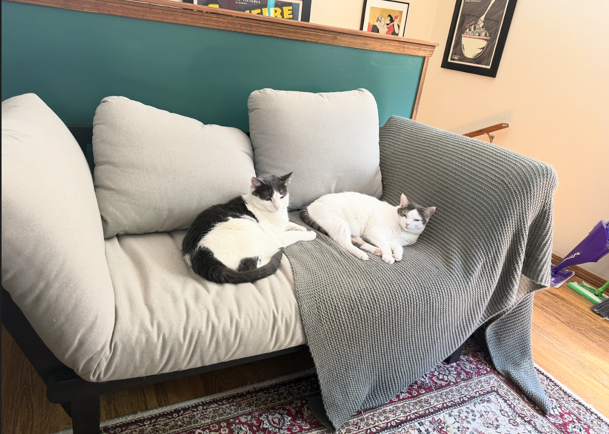
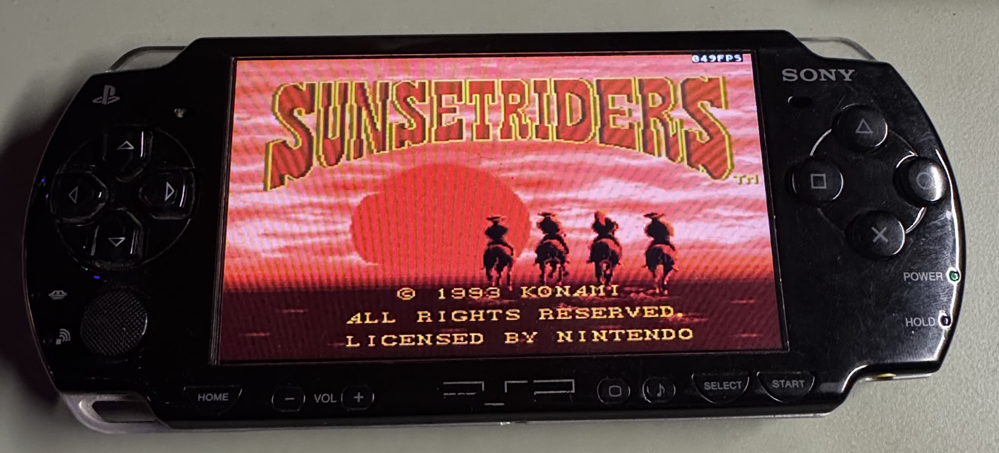
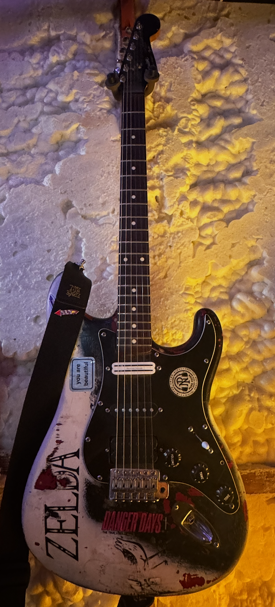
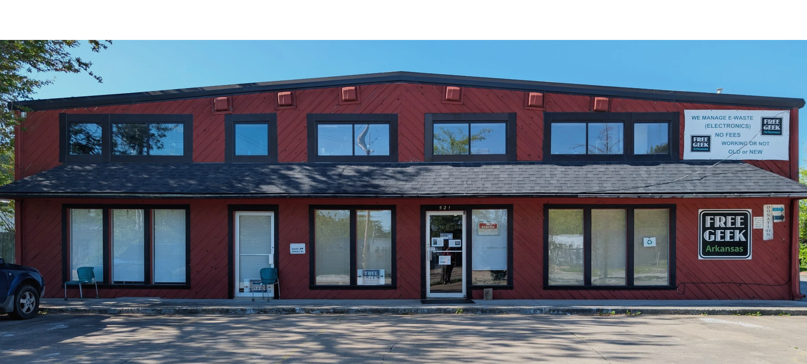
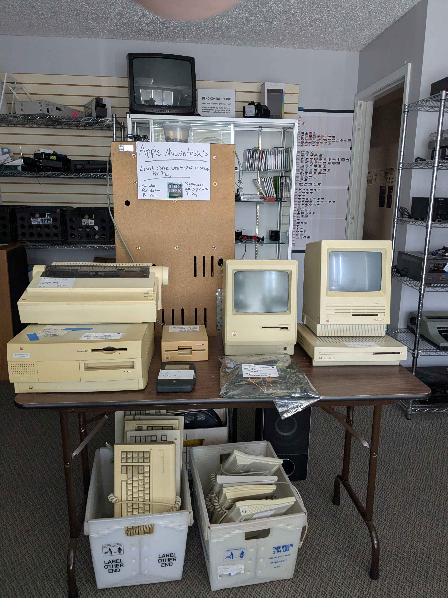
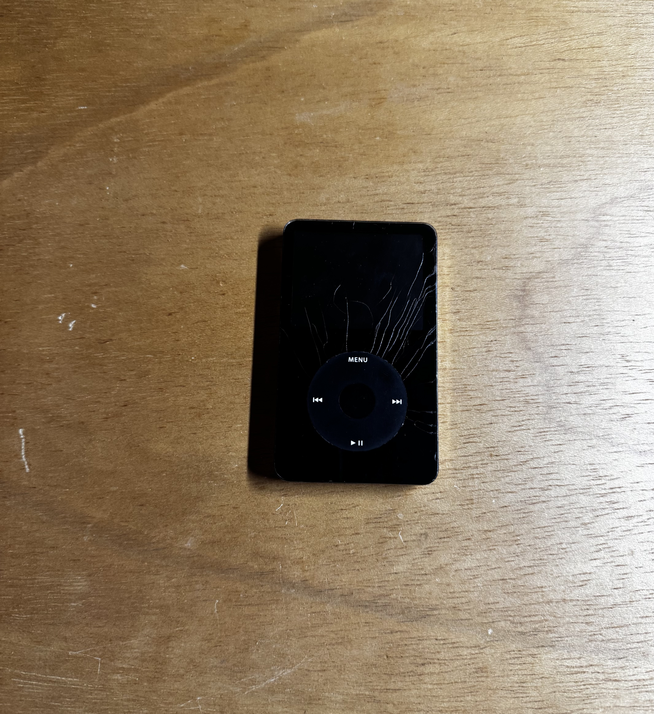
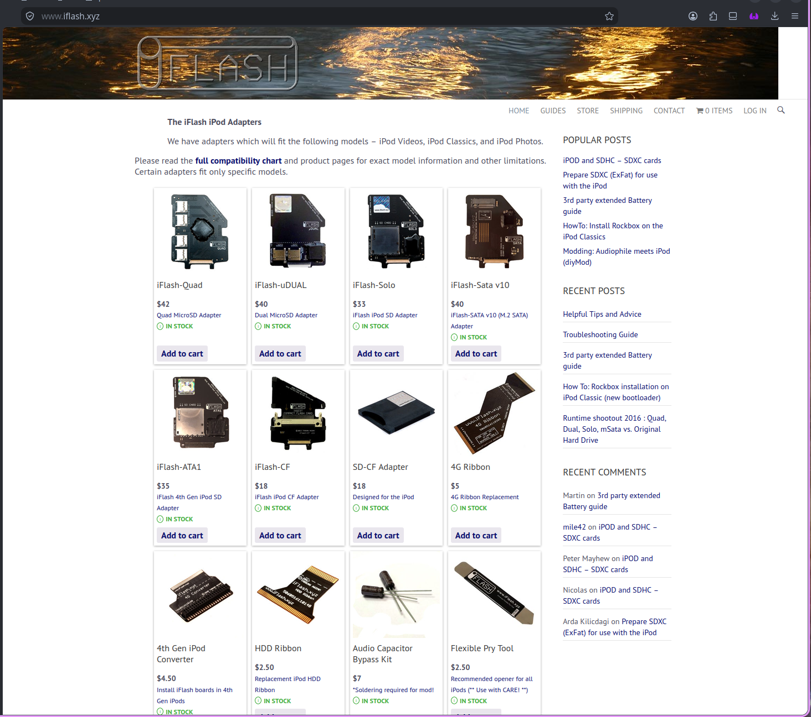
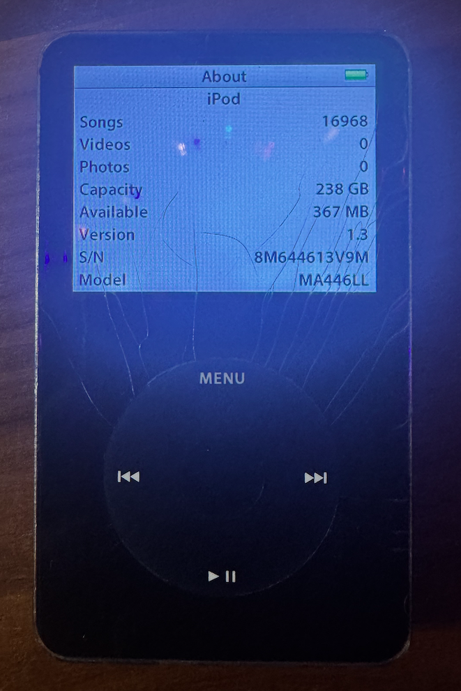
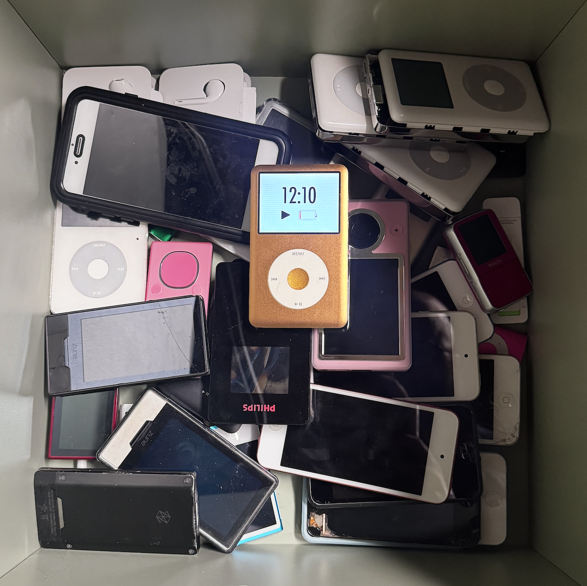

New Slide Who Dis?
===
<!-- font_size: 2 -->
<!-- alignment: center -->
Dublin
<!-- pause -->
<!-- speaker_note: SE on a PLG team at CompanyCam -->
- Senior Engineer
<!-- speaker_note: used to be a react dev but Claude writes everything now -->
<!-- pause -->
- BA in Computer Science @uark, December 2015
<!-- column_layout: [3, 2] -->
<!-- column: 0 -->
<!-- pause -->

Howl and Aunty Whispers
<!-- column: 1 -->
<!-- pause -->

Big Eye, Jelly Boy, Hennsylvania, Bekahh, etc..
<!-- pause -->
<!-- end_slide -->
How Did I Get Here?
===
<!-- font_size: 2 -->
<!-- alignment: center -->
<!-- speaker_note: why am i giving a talk about ferrous pasta and old stuff -->
<!-- pause -->
<!-- speaker_note: Growing up in NJ I had access to lots of things to mess around with, stripping down old bikes and not putting them back together -->
Tinkering and modding stuff
<!-- pause -->
<!-- column_layout: [3, 2] -->
<!-- column: 0 -->
<!-- speaker_note: cobbled together a PSP that I could softmod from broken ones I bought off of friends, had to take them apart to see what version number the motherboards had and built one back together -->

<!-- column: 1 -->
<!-- pause -->


<!-- reset_layout -->
<!-- pause -->
It brings me joy to see stuff work longer than intended.
<!-- pause -->
It's a supreme act of ownership to repair and maintain.
<!-- end_slide -->

The Gateway
===
<!-- font_size: 2 -->
<!-- pause -->
<!-- speaker_note: Lovely little place down in Fayetteville called FreeGeek -->

<!-- alignment: center -->
<!-- pause -->
521 W Ash St, Fayetteville, AR 72703 (down the road from Fossil Cove)
<!-- pause -->
Services:
<!-- column_layout: [3, 2] -->
<!-- column: 0 -->
<!-- speaker_note: they take almost any electronic item, even car batteries, someone dropped off a telephone switchboard one time -->
e-waste recycling
<!-- pause -->
<!-- speaker_note: reimage machines and put linux on them so they can be re-sold -->
<!-- speaker_note: similar to geeksquad -->
IT support
<!-- pause -->
<!-- speaker_note: testing and pricing electronic items for sale in the thrift store -->
<!-- speaker_note: depending on skillset you can specialize in certain tech -->
<!-- speaker_note: volunteer hours count towards class credits -->
<!-- column: 1 -->
Volunteering
<!-- pause -->
Education

<!-- reset_layout -->

enabling my crippling addiction to hoarding outdated technology via their thrift store

<!-- end_slide -->
Reject modernity; return to ~~monke~~ froot
===
<!-- font_size: 2 -->
<!-- alignment: center -->
<!-- pause -->
<!-- speaker_note: this is the first one I picked up, a 5.5th Gen iPod (if it has search then it's 5.5th gen!) -->
<!-- speaker_note: I was so excited, I hadn't had one since 2011, I had a large music collection leftover from highschool that I've been carrying around on HDDs I can explore again -->
<!-- speaker_note: No more using spotify, I was free -->
<!-- column_layout: [3, 2] -->
<!-- column: 0 -->
2024

<!-- column: 1 -->
<!-- pause -->
Walking out the store like:


<!-- reset_layout -->
<!-- pause -->
Wait..
<!-- pause -->
is this good enough?
<!-- end_slide -->
Time To Upgrade
===
<!-- font_size: 2 -->
<!-- column_layout: [3, 2] -->
<!-- pause -->

<!-- column: 0 -->
<!-- speaker_note: using ALAC for a lot of my music, blows their estimation of 4min @128Kbps mp3 back in the elder days -->
- 320GB library, many lossless formatted
<!-- pause -->
- 30GB stock, small boi
<!-- pause -->

<!-- pause -->
<!-- alignment: center -->
ZIF compatible storage powered by SD Cards
<!-- speaker_note: show the iPod and demonstrate how you'd open it -->
<!-- column: 1 -->
<!-- speaker_note: the hardware is designed to interface with the iPods, so they have a ZIF connector, just pop out the old ZIF drive and put the new one in -->

<!-- alignment: left -->
<!-- pause -->
- iFlash Solo
<!-- pause -->
- 256GB SD Card
<!-- pause -->
<!-- alignment: center -->

- big space
<!-- pause -->
- we're done!
<!-- reset_layout -->
<!-- alignment: center -->
<!-- pause -->

I am enjoying this.
<!-- end_slide -->

The End
===
<!-- font_size: 2 -->
<!-- pause -->
<!-- alignment: center -->
<!-- speaker_note: and... another -->
<!-- end_slide -->

The Spiral Continues
===
<!-- font_size: 2 -->

<!-- alignment: center -->
<!-- pause -->


<!-- speaker_note: Fast forward a few months, and things have dengenerated, I have this giant pile of devices, I've upgraded / repaired a lot of them, some are just hunks of junk because of activation lock. -->
<!-- end_slide -->

The Ingredients
===
<!-- font_size: 2 -->
<!-- speaker_note: this is where the germ of rusty spaghetti starts to take shape -->
<!-- alignment: center -->
<!-- pause -->
Accumulated a lot of devices
<!-- pause -->
<!-- speaker_note: nothing much to cover in the way of upgrading Zunes other than they can't read greater than 120GB if I remember right, and you can only use a few select SSD type ZIF Drives, iPod Classics and Zunes share similar batteries though! -->
iPods, Zunes, GoGears
<!-- pause -->
Upgrades, repairs, lack of parts
<!-- speaker_note: as far as I can tell, you cannot purchase the screen to repair a Philips GoGear 30GB -->
<!-- pause -->
All this sprawl makes managing these devices on one app


<!-- end_slide -->
Constraints
===
<!-- font_size: 2 -->

<!-- speaker_note: I have a fun set of constraints, also I may have missed an app in the ecosystem that would have made this easier but I was already thinking about the recipe, in my dreams --> 
<!-- alignment: left -->
<!-- pause -->
Windows has the best compatibility
<!-- pause -->
  - I don't use it  
<!-- pause -->
macos is iPod support
<!-- pause -->
  - Apple Music has no Zune support
<!-- pause -->
  - funky behavior on newer OS versions
<!-- pause -->
Rockbox is pretty good
<!-- pause -->
  - USB session timeouts when moving tracks
<!-- pause -->
  - also no Zune support
<!-- pause -->
Alternatives:
<!-- pause -->
  - gtkpod, but no Zune support
<!-- pause -->
  - buy an older mac, bootcamp windows
<!-- pause -->
  - VM
<!-- pause -->
  - Build a cross OS compatible terminal based music player entirely in rust while selling my soul to anthropic while some bangin tunes play
<!-- pause -->

And no snakes. 
<!-- pause -->

<!-- speaker_note: you can probably figure out where the rest of this is going now -->
<!-- end_slide -->


Preamble: 
===
<!-- font_size: 2 -->
<!-- alignment: center -->
<!-- pause -->
- It's vibes all the way down
<!-- speaker_note: latish 2025 I think is when I started using LLMs wholesale at work and around March when I started working on this, I had a  -->
<!-- speaker_note: I cobbled the info together from memory/clauding about in the repo so I might get something wrong about a tech used or its function -->
<!-- pause -->
<!-- speaker_note: I'm going to talk about how great using Claude for this is, but I'm a little fatigued at the pace and I sorta feel my identity as an engineer getting degraded sorta -->
- Complicated feelings about LLMs now than back then
<!-- pause -->
<!-- speaker_note: I've never worked on a music app before, I leaned on claude to give me choices on how to proceed, at some point I stopped reading a lot of the prose it was writing -->
- I made lots of goofy decisions
<!-- pause -->
- If done again, I'd pay more attention
<!-- speaker_note: This talk is more about the bizarre speed at which I could iterate on something while getting inspired to try more as I went, because of Claude -->
<!-- end_slide -->

MVP
===
<!-- font_size: 2 -->
<!-- speaker_note: An overview of the MVP plus what we'll dig into -->
<!-- pause -->
<!-- alignment: left -->
<!-- speaker_note: this comes from Apple Music, I think it's a leftover option from the iTunes era, I don't actually know too much about what it's used for outside of this -->
- macos only to start
- Export and parse Library.xml
<!-- pause -->
- display album/artist/tracks, handle playback, search
<!-- pause -->
- CLI for ease of iterating with Claude
<!-- pause -->
<!-- speaker_note: I wanted to throw claude at this problem and see if it could put together something, at the time I was picking up and upgrading zunes -->
- manage media on Zunes
<!-- pause -->
- Themes!

<!-- pause -->
<!-- alignment: center -->
Kit:
<!-- column_layout: [5, 5] -->
<!-- column: 0 -->
<!-- pause -->
Patrician Crates 📦
<!-- alignment: left -->
* `ratatui` - TUI
<!-- speaker_note: basically you don't have to press enter, keypresses turn into events -->
* `crossterm` - interactive TUI
* `rodio` - playback 
<!-- speaker_note: Why this split? I tried to do the whole USB stack in Rust with rusb. Finding the Zune worked. The MTPZ handshake did not — Mac libusb fails every time you send data TO the device (the certificate), error 0x2002. android-file-transfer already talked IOKit on Darwin and the handshake worked. So the tradeoff became rusb for detection, aft-mtp-cli So I shipped rusb to detect, shell out to aft-mtp-cli for everything real. IOKit FFI in-process is the later zune-mtp chapter. Linux wasn't in the MVP. -->
* `rusb` — USB ops
* `quick-xml` - XML parsing
<!-- column: 1 -->
<!-- alignment: center -->
Plebian Libs 📚:
<!-- alignment: left -->

<!-- speaker_note: MTPZ is microsofts secure version of mtp, basically mtp with an auth handshake, aft-mtp-cli is C++ and not rust, but I didn't think it made sense to try to build everything from scratch I wanted it to work first before trying to port libraries over -->
<!-- speaker_note: there's a whole sidequest hiding in here around modifying zune firmware versions I'm not going to get into for time -->
<!-- speaker_note: aft-mtp-cli has its own handshake TrustedApp::Create(session, ~/.mtpz-data), so it works out of the box -->
- `aft-mtp-cli` - C++ library rust shells out to -> MTP & MTPZ handshake
- `ffmpeg` - transcode to MP3 + 200×200 art
<!-- speaker_note: I guess rusb is cheating a little bit but that's okay it's an MVP -->
- `libusb` - what rusb uses under the hood
<!-- reset_layout -->
<!-- pause -->
<!-- speaker_note: I wasn't doing anything special here outside of heavily leveraging plan mode. -->
<!-- alignment: center -->
Claude will do it all.


<!-- end_slide -->

The Spaghetti Factory Opens
===
<!-- alignment: center -->
<!-- font_size: 2 -->
<!-- pause -->
- CLAUDE.md
- Prompt for plan/research -> review -> discuss -> choose and plan/implement:
  - -> test -> feedback -> retest
<!-- pause -->

<!-- speaker_note: even doing the most basic>
<!-- pause -->
Warp Speed:

<!-- speaker_note: Left column is v0.5.0 — the TUI binary, search, themes, Zune sync. Playback is not in that cut. Right column is when rodio / Now Playing land, which is what the kit slide claims. -->
<!-- column_layout: [5, 5] -->
<!-- column: 0 -->
<!-- pause -->
Mar 20–21:
* 9 commits
* 8,074 LOR
* 4,155 is TUI
* 11 themes & search
* no `rodio`
* ffmpeg + `aft-mtp-cli`
<!-- column: 1 -->
<!-- pause -->
<!-- speaker_note: By this commit zune-mtp is already in Cargo.toml (~2.6k lines, Mar 26). The kit slide still lists aft-mtp-cli as the MTP path — that's the story of the MVP, not the tree at playback. -->
Now Playing · Mar 27:
* 10,489 LOR
* 2,477 for playback
* `rodio`
* `zune-mtp` - 2,331 LOC port of aft-mtp-cli
<!-- reset_layout -->
<!-- speaker_note: we had to patch some things in order to get the TUX feeling right -->
<!-- pause -->
<!-- alignment: left -->
`aft-mtp-cli` command updates: 
<!-- speaker_note: scales with library size, without this, every time i t's plugged in you'd have to walk the artist/album tree which had to complete before you could interact with it -->
- `zune-init` - caching by device serial 
<!-- spa>
- `zune-import` - emit track ids 
<!-- speaker_note: this was to force updating if synced from another device, if I bounced between machines I wanted to be able to resync the device --> 
- `zune-refresh` — reset and re-walk the device for tracks
<!-- speaker_note: a Zune playlist is not a list of paths — it's SetObjectReferences of MTP handles. -->
- `zune-import` - (sync) emit track_id on stdout
<!-- speaker_note: Wanting to add what I'd consider basic support, playlists -->
- `create-playlist` - builds AbstractAVPlaylist playlists out of track_ids
<!-- pause -->
<!-- alignment: center -->
Wait but what's `zune-mtp`?
<!-- end_slide -->

zune-mtp
===
<!-- font_size: 2 -->
<!-- alignment: center -->
<!-- pause -->
<!-- speaker_note: libmtp-zune is a fork of libmtp which adds zune support, it's where the mtpz data file came from -->
Rust port using `aft-mtp-cli` and `libmtp-zune` as references
<!-- pause -->
`libmtp-zune` - written in C, based on `libmtp`
<!-- pause -->
C != Rust, sorry Dennis Ritchie
<!-- pause -->
<!-- speaker_note: into a native IOKit transport, bypassing libusb entirely because libusb
can't do the data-out operations the handshake needs. -->
<!-- alignment: left -->
`zune-mtp` ports that protocol knowledge
- handshake, hardware read, media read
- push, rm, playlists, album art
- ZMDB extraction (no more device walks)
<!-- pause -->
<!-- alignment: center -->
Aww CRUD, it works


<!-- end_slide -->

The End cont.
===
<!-- font_size: 2 -->

<!-- alignment: center -->

<!-- pause -->
We did it! We're done!

<!-- pause -->
Talks to a Zune. Apple Music can handle iPods.

<!-- speaker_note: You might be wondering where the slide on linux support is, I recall it took maybe an hour of testing to see what was broken, and for the sake of narrative and time I'm glossing over it, and lots of other stuff -->
<!-- pause -->
(behind the scenes) Linux is working!

<!-- pause -->
Well, almost..

<!-- pause -->
<!-- speaker_note: aft-mtp-cli is gone — no more stdin/stdout REPL. zune-mtp talks IOKit in-process. What's still C, ffmpeg for transcode (until Apr 3), libusb behind rusb for USB detect. iPods are still Apple Music — that's the next slide. -->
<!-- speaker_note: can't really get away from this one -->
`ffmpeg` and `libusb` are still here
<!-- pause -->
no iPod support

locked into Library.xml
<!-- pause -->
Cruft!

<!-- end_slide -->

Reject spaghett; return to Rust
===
<!-- font_size: 2 -->

<!-- column_layout: [3, 2] -->
<!-- column: 0 -->
<!-- alignment: left -->
<!-- pause -->
Spaghett:
<!-- speaker_note: I'm pretty locked into what Apple Music is doing in order for Zytunes to work -->
- Library.xml -> not sustainable long term
<!-- speaker_note: I'm pretty locked into what Apple Music is doing in order for Zytunes to work -->
- Ripping CDs in Apple Music
- `Automatically Add to Music` folder
- The barest of standards applied
<!-- pause -->

<!-- column: 1 -->
Rusty Spaghett:
<!-- pause -->
- Add directory traversal and cache building (in JSON), updates on app start
<!-- pause -->
(Most of) `ffmpeg` swapped for:
<!-- speaker_note: great for a library of mixed files -->
- `symphonia` - audio decoder
<!-- speaker_note: Zune only supports WMA, AAC, and MP3, so we need to transcode the file if it's incompatible -->
- `mp3lame-encoder` - JIT transcoding audio files
<!-- pause -->
Also:
- `lofty` - adds metadata parser and writer
<!-- speaker_note: lofty works across files my files -->
- `discid` — CD id reads via `libdiscid` (similar to `rusb`)
<!-- pause -->
And:
- TDD
- refactors
<!-- reset_layout -->
<!-- alignment: center -->
<!-- pause -->
Feature (Re)Factory!
<!-- pause -->
- use tdd during refactors to understand what breaks
<!-- pause -->
- parallelize directory reads
<!-- pause -->
- music brainz client for metadata
<!-- pause -->
- ASCII & half-block album art
<!-- pause -->
- more themes + visualizers
- playcount aggregation from device
<!-- pause -->
- compact disc ripping via `ffmpeg`
- `ipod-db` crate
<!-- end_slide -->

ipod-db
===
<!-- font_size: 2 -->
TODO from here on and then you're done!

<!-- alignment: center -->
Apr 7th - 16th
<!-- pause -->
Much easier than the Zune
<!-- pause -->
- No handshake, mounts as a USB storage device
<!-- pause --> 
- Real challenge: parse and write back the iTunesDB
<!-- pause -->
<!-- speaker_note: fortunately gtkpod did this already and allows us to access an iPod -->
- `libgpod` -> split from gtkpod, written in C
<!-- pause -->
<!-- speaker_note: I remember around this time I was brute force checking it over and over and over, very bad habit I probably wasted a lot of time here, I'd have claude update the DB and I'd report back, it was a slog -->
<!-- pause -->
ipod-db does this
<!-- pause -->
<!-- alignment: left -->
How the DB is built:
<!-- speaker_note: audio files are NOT the library. they live in hashed F00-F49 names. the iPod only plays what iTunesDB says exists. lowercase .mp3/.m4a — FAT doesn't care, firmware does. -->
- copy audio into `iPod_Control/Music/F00..F49/`
<!-- pause -->
<!-- speaker_note: every record is 4-byte ASCII magic, then u32 header_size, u32 total_size, then payload. header_size lets you skip unknown fields so a Video, Mini, and Classic can share a parser. little-endian. strings are UTF-16LE. -->
- the whole file is nested **chunks** — 4-byte magic + sizes + payload
<!-- pause -->
<!-- speaker_note: mhbd = database header (db_id, version, hash58). mhsd = one dataset. order is load-bearing 4 albums, 1 tracks, 3 podcasts, 2 playlists, 5 smart playlists. -->
- `mhbd` wraps `mhsd` datasets: albums, then tracks, then playlists
<!-- pause -->
<!-- speaker_note: mhit is one song's numeric row — track id, duration, bitrate, rating, file size, ~624 byte header. it does NOT hold the title. child mhods are typed blobs 1=title, 2=path in F-dirs, 3=album, 4=artist. existing tracks we replay the raw mhit+mhods blob so mystery fields survive new tracks we write from scratch and number from 52. -->
- one track = one `mhit` (numbers) + child `mhod`s (title, path, artist)
<!-- pause -->
<!-- speaker_note: HMAC-SHA1 at mhbd+0x58 keyed by FirewireGuid. wrong hash = empty library, no error. id_0x24 must come from mhbd+0x24, not db_id. -->
- sign `hash58` or the Classic shows "No Music"
<!-- end_slide -->

Stems
===
<!-- font_size: 2 -->

<!-- alignment: center -->
<!-- speaker_note: Before I demo. Press M on a playing track. Nothing about this is in-process Rust inference — we shell out, same as ffmpeg for rip/video. -->
Python!
<!-- pause -->
<!-- speaker_note: I didn't want to bundle this with the install as it'd add gigs for torch + checkpoints. The AI part is opt-in. uv is a Python package manager written in Rust. First M, we ask, then uv tool install into ~/.local/share/zytunes/bin. CPU pin so you don't pull CUDA. -->
- `uv` installs an **engine** after you say yes — never at startup
<!-- pause -->
<!-- alignment: left -->
<!-- speaker_note: Engine is the CLI. demucs for the default recipe. audio-separator (pinned 0.44.3) for hq — it can run Roformer checkpoints AND htdemucs_6s under one binary. That's why we didn't keep two Python stacks for the fancy recipes. -->
- **engine** — `demucs` or `audio-separator`, a subprocess
<!-- pause -->
<!-- speaker_note: Checkpoints are the weight files, 200 MB to 1 GB each. audio-separator would drop them in /tmp and lose them on reboot, so we pin model_file_dir to ~/.cache/zytunes/models. Pinned names are BS-Roformer ep_317, Mel-Roformer karaoke, htdemucs_6s.yaml. Swap a checkpoint, bump the recipe cache id, old mixes re-separate. -->
- **checkpoints** — the weight files, cached under `~/.cache/zytunes/models`
<!-- pause -->
<!-- speaker_note: A model is what a pass asks the engine to run. htdemucs_6s is six sources in one shot. Every strong Roformer is vocals/instrumental only. -->
- **model** — which checkpoint a pass actually runs
<!-- pause -->
<!-- speaker_note: A recipe is engine plus ordered passes plus stem layout. Demucs is Meta's splitter, one shot, six stems, repo archived. Roformers are newer vocal models, better isolation, only two stems. No Roformer does drums/bass/guitar, so hq cascades. -->
- **recipe** — which pipeline `[stems] recipe` selects
<!-- pause -->
- `demucs` — one pass, six stems
<!-- pause -->
<!-- speaker_note: First pass, BS-Roformer on the source gives vocals and instrumental. Second pass, htdemucs_6s on that instrumental gives drums/bass/guitar/piano/other. Same six-stem strip as demucs, better vocals. -->
- `hq` — Roformer vocals, then demucs on the leftover
<!-- pause -->
<!-- speaker_note: Same two passes, then Mel-Roformer karaoke on the isolated vocal gives lead and backing. Seven stems. That's the Rock Band harmony trick. -->
- `hq-harmony` — that, plus lead + backing (seven stems)
<!-- pause -->
<!-- alignment: center -->
We have Rock Band harmony vocals at home now.

<!-- end_slide -->

Demo
=== 
<!-- speaker_note: Ctrl+E hands the terminal to zytunes-tui. q in the TUI returns to the deck. -->
<!-- pause -->
```bash +exec +acquire_terminal
/// if ! command -v zytunes-tui >/dev/null 2>&1; then
///   exec "$(git rev-parse --show-toplevel)/target/release/zytunes-tui"
/// fi
zytunes-tui
```
<!-- snippet: >

<!-- end_slide -->


<!-- end_slide -->

In The End
===
<!-- font_size: 2 -->

<!-- alignment: center -->
<!-- pause -->
It's still spaghetti
<!-- pause -->
<!-- speaker_note: I got to focus a lot on tradeoffs and choices instead of getting bogged down into learning a single library -->
Since LLM's did all the heavy lifting I spent more time considering the system itself, and even with odd decisions made earlier, it was very easy to pivot. 
<!-- speaker_note:  -->
<!-- pause -->

<!-- pause -->
I learned so much more.
<!-- pause -->

TDD is clutch.

<!-- end_slide -->

Thank you
===
<!-- font_size: 2 -->

<!-- alignment: center -->

<!-- pause -->
`github.com/Danondso/zytunes-suite`
<!-- pause -->
